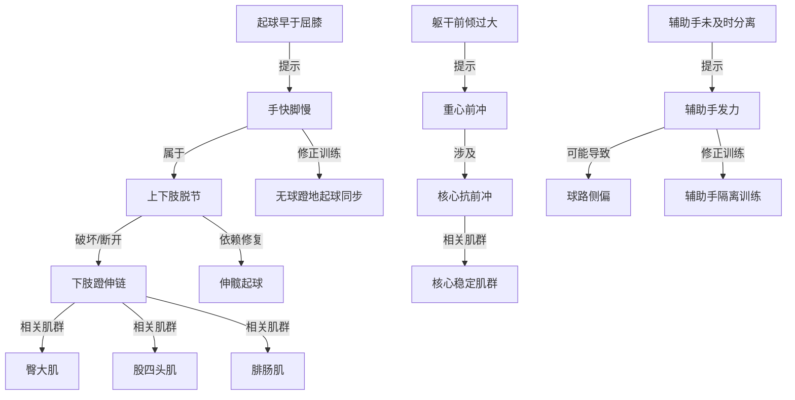

# 关系总览

## 关系类型统计

- 共现: 16106
- 关联节点: 1794
- 提示: 12
- 相关肌群: 7
- 修正训练: 6
- 涉及: 6
- 相关问题: 2
- 属于: 1
- 破坏/断开: 1
- 依赖修复: 1
- 可能导致: 1
- 参与倾向: 1
- 参与: 1

## 核心路径

```mermaid
graph TD
  A["起球早于屈膝"] -->|提示| B["手快脚慢"]
  B -->|属于| C["上下肢脱节"]
  C -->|破坏/断开| D["下肢蹬伸链"]
  C -->|依赖修复| Q["伸髋起球"]
  D -->|相关肌群| E["臀大肌"]
  D -->|相关肌群| F["股四头肌"]
  D -->|相关肌群| G["腓肠肌"]
  B -->|修正训练| H["无球蹬地起球同步"]
  I["躯干前倾过大"] -->|提示| J["重心前冲"]
  J -->|涉及| K["核心抗前冲"]
  K -->|相关肌群| L["核心稳定肌群"]
  M["辅助手未及时分离"] -->|提示| N["辅助手发力"]
  N -->|可能导致| O["球路侧偏"]
  N -->|修正训练| P["辅助手隔离训练"]
```